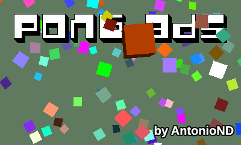
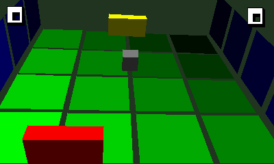

# Pong 3DS
A 3D pong game for 3DS with software rendering. By AntonioND (Antonio Niño Díaz)

[https://github.com/AntonioND/pong-3ds](https://github.com/AntonioND/pong-3ds)

[http://antoniond_blog.drunkencoders.com/](http://antoniond_blog.drunkencoders.com/)

This is just a 3D pong, inspired by my old Pong 3DS for Nintendo DS: [http://antoniond.drunkencoders.com/pong3ds.html](http://antoniond.drunkencoders.com/pong3ds.html)

This was a test to see if I could manage to setup a correct perspective for stereoscopic 3D, but I decided to make a simple game out of it.

I haven't used hardware accelerated graphics because I couldn't manage to compile any shader assembler (except from Picasso, but it's a bit outdated). I originally made this 3D software engine for GBA, so there are still a few files from Tonc's library for GBA.

If anyone cares, the 3D engine can draw lines, triangles, quads, line strips, triangle strips and quad strips, all of them With alpha blending. Quads are drawn using a function used just for them to draw them faster, not by drawing two triangles. It supports directional lighting (up to 32 lights, limited to 2 because why more) and ambient lighting. It can sort polygons with painter's algorithm (no buffer-Z). 

Oh, the 3D slider actually does something when you change its position. The engine renders each top screen in a separate core when working in 3D mode to make it run always at the same FPS.

Press SELECT to take a screenshot in PNG format (2 files in 3D mode, 1 in 2D mode) or START to exit. Use the joystick to move the pad.

For now, in the main menu, press A or X to enter a game room. Pressing Y in a room will return the game to the main menu.

This game is licensed under the MIT license.

