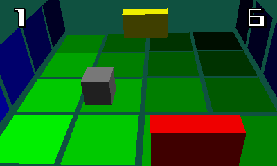

# Pong 3DS
A 3D pong game for 3DS with software rendering. By AntonioND (Antonio Niño Díaz)

[https://github.com/AntonioND/pong-3ds](https://github.com/AntonioND/pong-3ds)

[http://antoniond_blog.drunkencoders.com/](http://antoniond_blog.drunkencoders.com/)

This is far from complete. Actually, it's just a test to see if I could manage to setup a correct perspective for stereoscopic 3D.

I haven't used hardware accelerated graphics because I couldn't manage to compile any shader assembler (except from Picasso, but it's a bit outdated). I made this 3D software engine for GBA, so there are still a few files from Tonc's library for GBA.

If anyone cares, the 3D engine can draw lines, triangles, quads, line strips, triangle strips and quad strips. It supports directional lighting (up to 32 lights, limited to 2 because why more) and ambient lighting. It can sort polygons with painter's algorithm (no buffer-Z).

Press SELECT to take a screenshot in PNG format (2 files in 3D mode, 1 in 2D mode) or START to exit. The D-Pad and the Joystick can be used to move left or right.

Oh, the 3D slider actually does something when you change its position.

