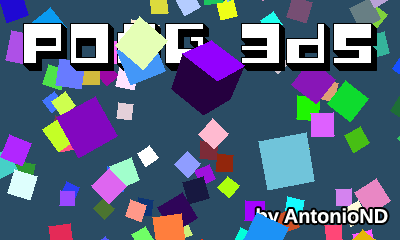
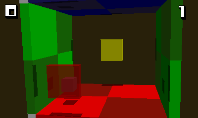

# Pong 3DS v1.0.1
A 3D pong game for the Nintendo 3DS with software rendering. By AntonioND (Antonio Niño Díaz)

[https://github.com/AntonioND/pong-3ds](https://github.com/AntonioND/pong-3ds)

[http://antoniond_blog.drunkencoders.com/](http://antoniond_blog.drunkencoders.com/)

This is just a 3D pong, inspired by my old Pong 3DS for Nintendo DS: [http://antoniond.drunkencoders.com/pong3ds.html](http://antoniond.drunkencoders.com/pong3ds.html)

This was a test to see if I could manage to setup a correct perspective for stereoscopic 3D, but I decided to make a simple game out of it.

I haven't used hardware accelerated graphics because I couldn't manage to compile any shader assembler (except from Picasso, but it's a bit outdated). I originally made this 3D software engine for GBA, so there are still a few files from Tonc's library for GBA. Anyway, this game always runs at 60 FPS. :)

If anyone cares, the 3D engine can draw lines, triangles, quads, line strips, triangle strips and quad strips, all of them With alpha blending. Quads are drawn using a function used just for them to draw them faster, not by drawing two triangles. It supports directional lighting (up to 32 lights, limited to 2 because why more) and ambient lighting. It can sort polygons with painter's algorithm (no buffer-Z). It doesn't support textured polygons.

Oh, the 3D slider actually does something when you change its position. The engine renders each top screen in a separate core when working in 3D mode to make it run always at the same FPS.

Press Y to take a screenshot in PNG format (2 files in 3D mode, 1 in 2D mode) or SELECT to exit. Use the joystick to move the pad, and A to jump in the 2.5D room.

For now, in the main menu, press a button in the touchscreen to enter a game room. Pressing START in a room will return the game to the main menu.

Holding L and R at the same time will show the FPS and the CPU usage.

This game is licensed under the GPL Version 3.

Thanks to:
----------

- smea for Ninjhax.
- smea, yellows8, plutoo, fincs and mtheall for ctrulib.
- smea, mtheall, GEMISIS, Fluto and Arkhandar for hbmenu.
- WinterMute for devkitARM and 3dslink.
- mtheall for ftbrony.
- Andreas Nylin for the font Polygon Power.
- JuDelCo, NightFox and icesoul for putting up with me during the developement of this game.
- DrPetter for sfxr.
- Claudio Matsuoka and Hipolito Carraro Jr for Extended Module Player Lite.

Music (http://modarchive.org/):
- 'Kaos och Dekadens' by Nightbeat
- 'Essentials Intact' by Nightbeat
- 'Roots' by Nightbeat
- 'Secret Message' by Frequent/Ephidrena

License
-------

Pong 3DS. Just a pong for the Nintendo 3DS.
Copyright (C) 2015 Antonio Niño Díaz

This program is free software: you can redistribute it and/or modify
it under the terms of the GNU General Public License as published by
the Free Software Foundation, either version 3 of the License, or
(at your option) any later version.

This program is distributed in the hope that it will be useful,
but WITHOUT ANY WARRANTY; without even the implied warranty of
MERCHANTABILITY or FITNESS FOR A PARTICULAR PURPOSE.  See the
GNU General Public License for more details.

You should have received a copy of the GNU General Public License
along with this program.  If not, see <http://www.gnu.org/licenses/>.
